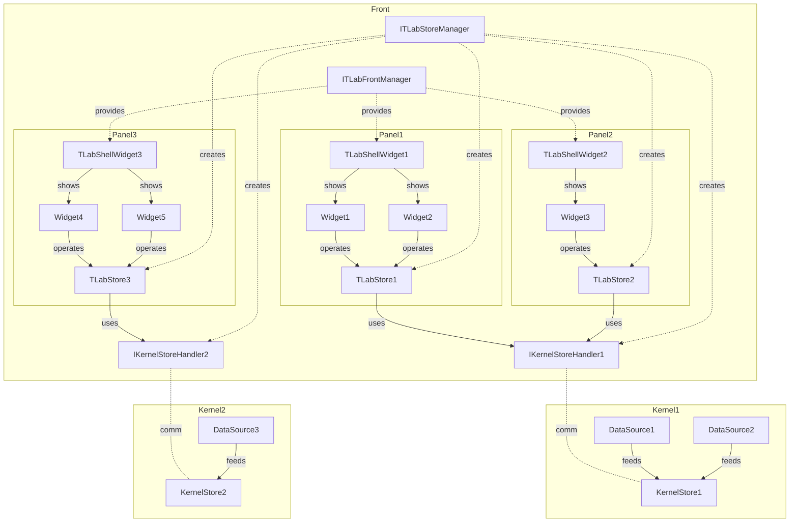
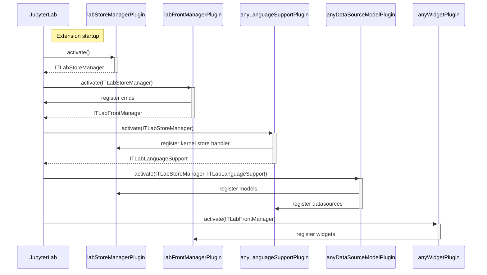
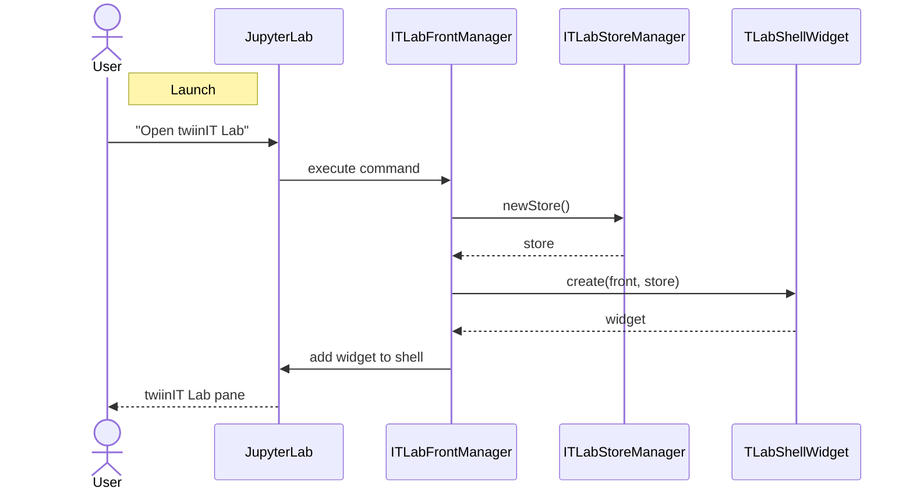
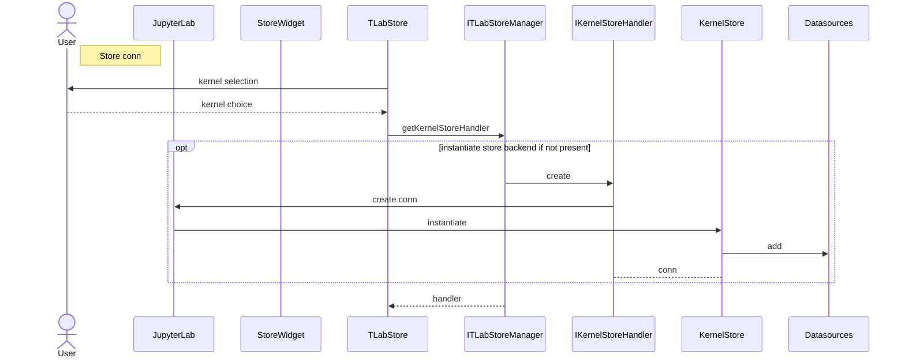
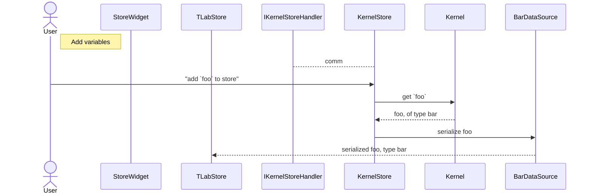
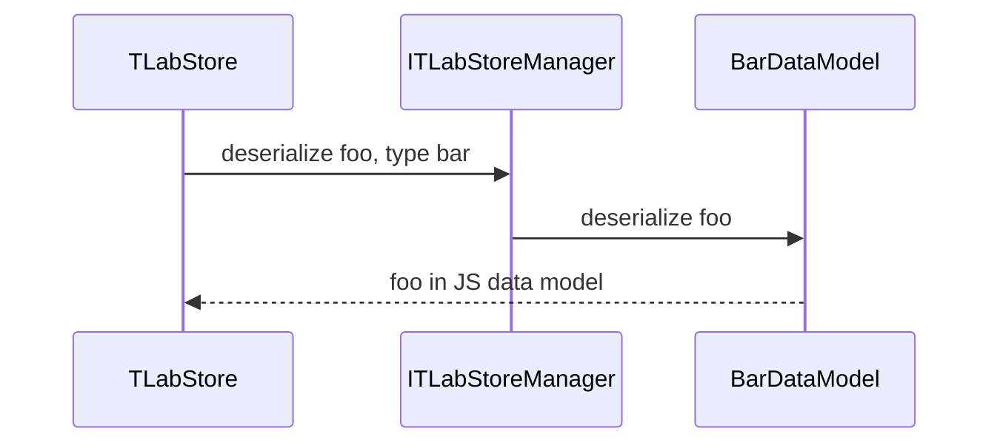
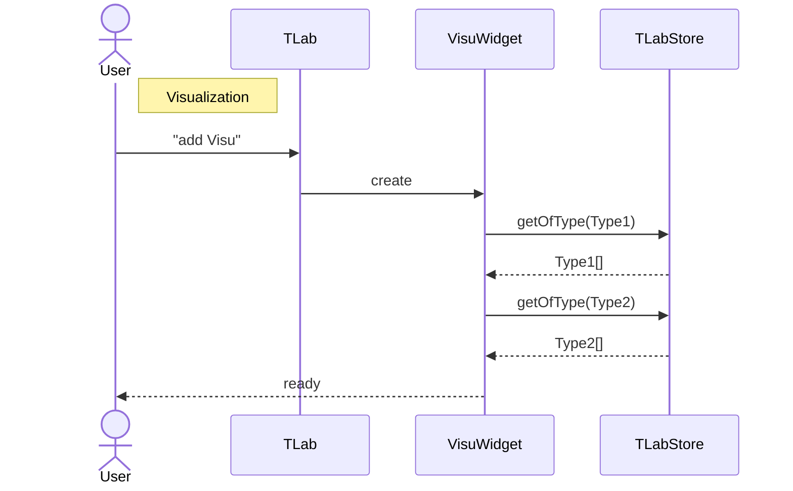

# twiinIT Lab Architecture

## Overview

- Visualization widgets are registered in `TLabFrontManager`.
- These widgets use available data in store.
- Stores are managed by `ITLabStoreManager`. They have a front part `TLabStore` exposed to widgets and a kernel language-dependant side: a kernel store handler implementing `IKernelStoreHandler` and the in-kernel store.
- Kernel stores are fed by data sources.

## Sequence diagrams

### Startup

Core plugins include `labFrontManagerPlugin` and `labStoreManagerPlugin`.
Other plugins include language support, data sources, models and widgets.

### Launch

Each twiinIT Lab "view" (`TLabShellWidget`) gets its own `TLabStore` instance.

### Store connection

Each `TLabStore` has a language-specific `IKernelStoreHandler` shared by all stores on the same kernel. `IKernelStoreHandler` is responsible for instantiating the kernel store and establishing a connection with it.

### Add variable

### Visualization

