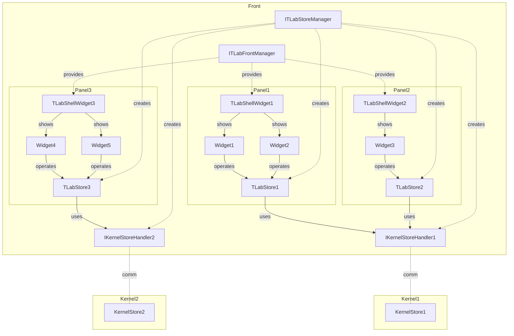
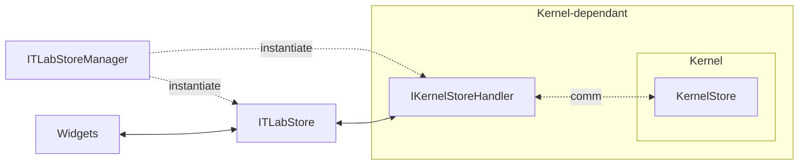
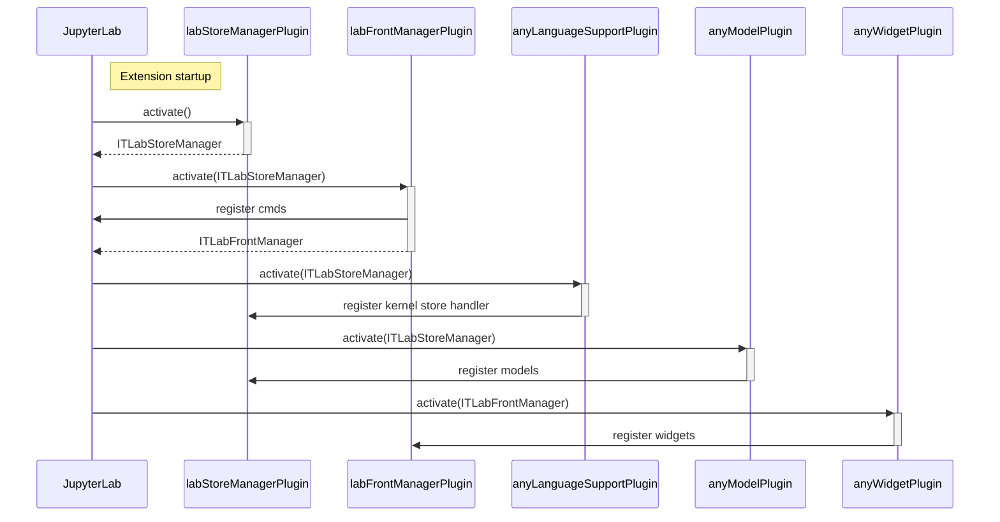
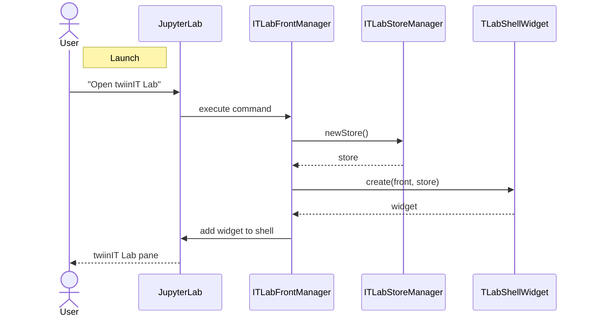
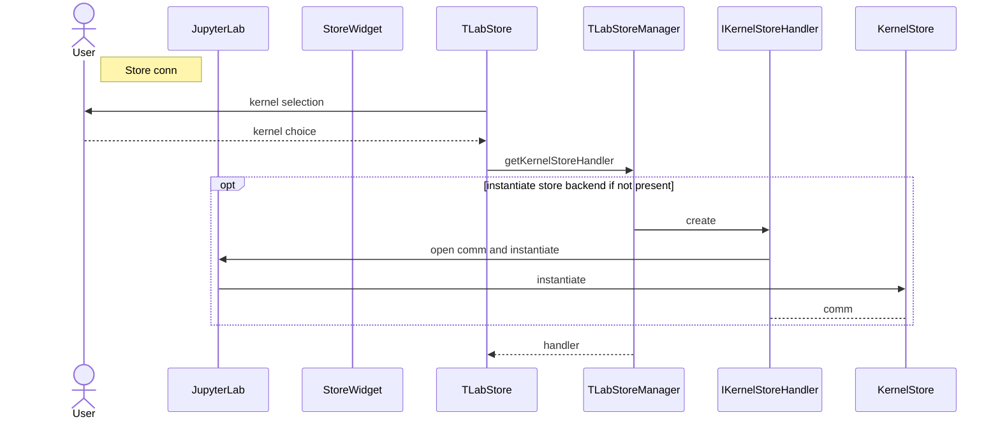
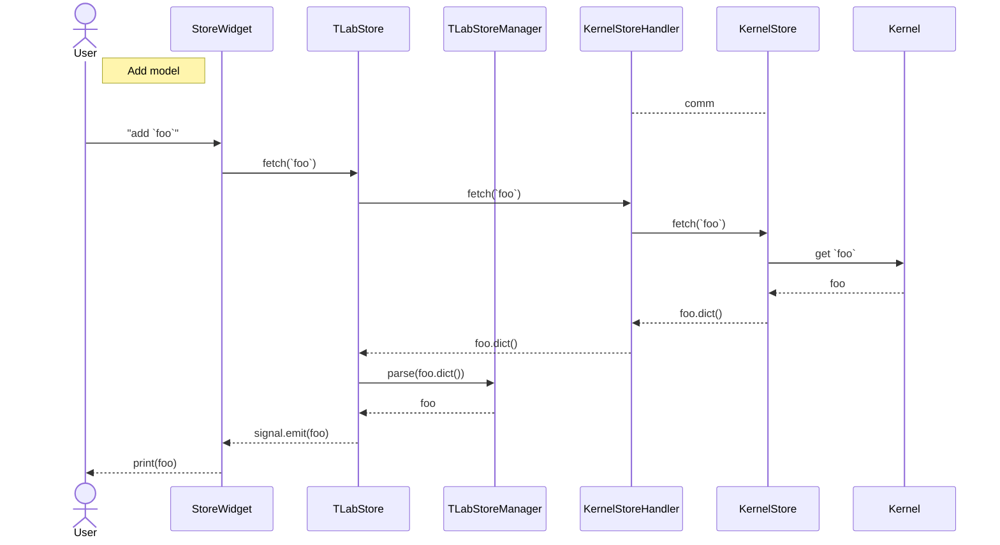
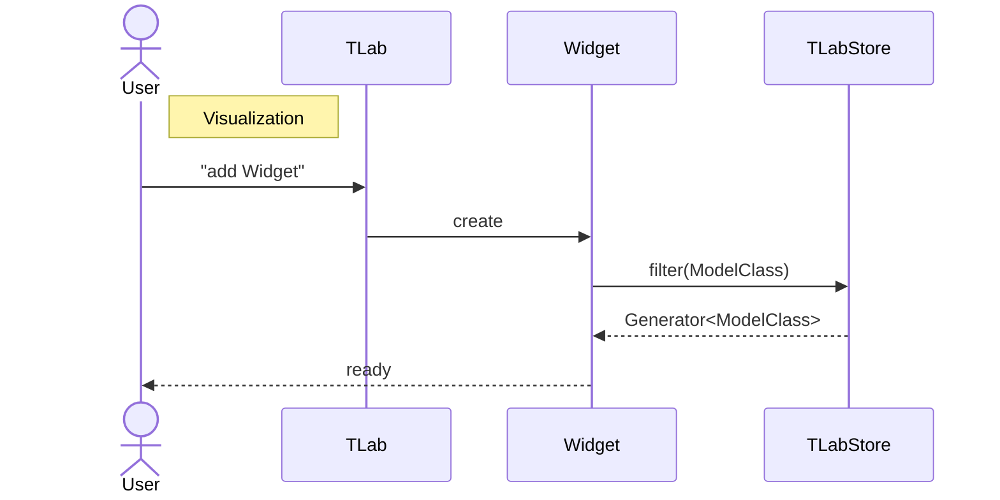

# Architecture

## Overview

### Front

**Packages:**

- [Front](../src/front/)
- [Controller widget](../src/widget-controller/)
- [Kernel widget](../src/widget-kernel/)
- [Plotly widget](../src/widget-plotly/)

TLab inferface is based on [FlexLayout](https://github.com/caplin/FlexLayout). Each widget is registered in the `ITLabFrontManager` and consume models from the store.

### Store

**Packages:**

- [Store](../src/store/)
- [Python plugin](../src/python/)
- [Python module](../tlab/)

The store exposes data models to the widgets.

It is made of four entities: `ITLabStoreManager`, `ITLabStore`, `IKernelStoreHandler` on the frontend, and the store in kernel. The last two are kernel/language bounded.

### Data models

**Packages:**

- [Built-in models – Front](../src/builtins/)
- [Built-in models – Python](../tlab/builtins.py)

Data models contains synced attributes.
They are defined both in the frontend and kernel.

## Sequence diagrams

### Startup

### Launch

Each twiinIT Lab "view" (`TLabShellWidget`) gets its own `TLabStore` instance.

### Store connection

Each `TLabStore` has a language-specific `IKernelStoreHandler` shared by all stores on the same kernel. `IKernelStoreHandler` is responsible for instantiating the kernel store and establishing a connection with it.

### Add model

### Visualization

