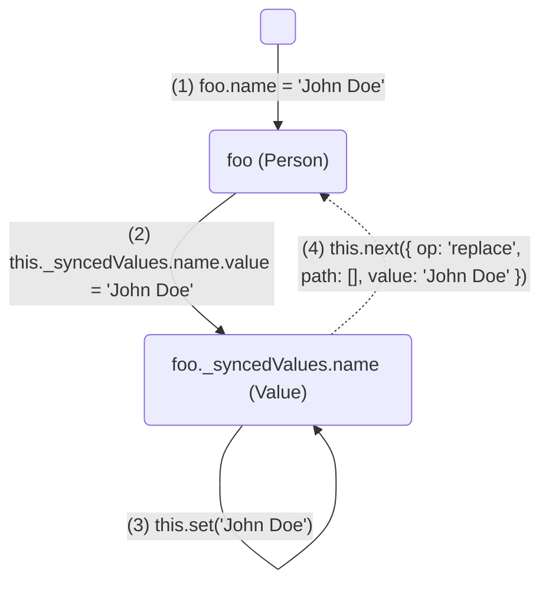
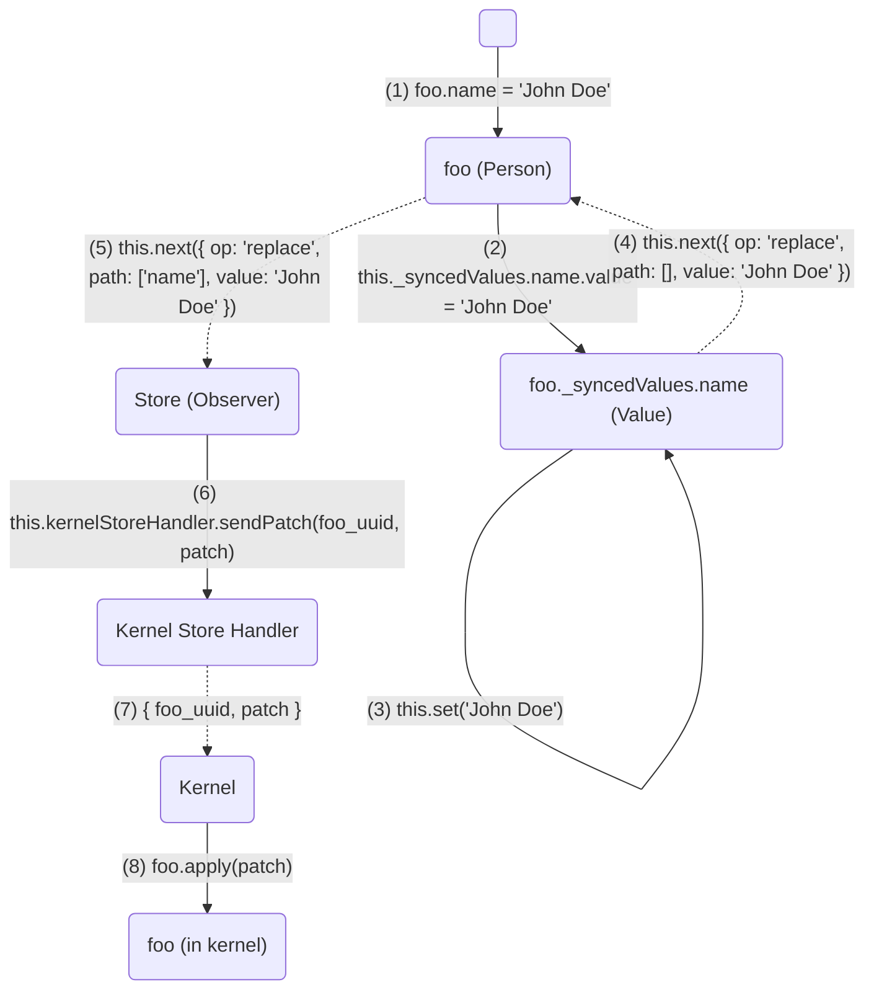

# Models

This document explains the design choices made in TLab to achieve the reactivity of models in twiinIT Lab.

## What is a model?

Practically, a model represents a data and its operations.

In twiinIT Lab, a model can live both in the JupyterLab front and the kernel back to perform heavy computation. We must ensure that both instances synchronise a same state and that they can communicate to run the calculations or any other operation.

## Synchronization

The goal is to capture the mutations made on the model object and broadcast the changes to the other instances.

To accomplish this, we use the power of getter/setter and [ReactiveX](https://reactivex.io) to create [_subject_](https://reactivex.io/documentation/subject.html) models which react on changes.

The following parts explain the implemetation of twiinIT Lab models on the JS frontend using `get`/`set` and [RxJS](https://rxjs.dev). The logic is the same if you want to implement models in other languages.

### Reactivity

Let us define a `Person` model as such:

```ts
const deserialize = ...
const serialize = ...

class Person extends Model {
  static _modelName = 'Person';
  _modelName = Person._modelName;

  @sync({ deserialize, serialize }) name = '';
  @sync() age = 0;
  @sync() speakFrench = false;
}
```

What we have done here is:

- define a `Person` model
- with 3 synced attributes: `name`, `age` and `speakFrench` marked with the `@sync()` decorator
- default values of `''`, `0` and `false`
- the `name` field has customs (de)serializer

The `Model` abstract base class extends the `Subject` class from RxJS and add a treatment of the `@sync`ed attributes.

Let us instantiate a `Person` object:

```ts
const foo = new Person();
```

What happens when doing this?

First, the prototype chain is constructed and `@sync`ed are saved:

```ts
foo = {
  // `Model` prototype with `Person` constructor
  __proto__: {
    constructor: Person,
    // Filled by @sync(...)
    _syncedKeys: {
      name: { deserialize, serialize },
      age: undefined,
      speakFrench: undefined
    },
    __proto__: Subject.prototype
  }
};
```

`foo.contructor` is called, it fills `foo._syncedValues` with `Value`s for each synced attribute.

`Value` exposes a `.value` reactive attribute that emit a JSON Patch when modified. It is a RxJS `Subject` that `foo` subscribes to.

For those who are familiar with Vue 3, it is similar to a [`ref()`](https://vuejs.org/guide/essentials/reactivity-fundamentals.html#reactive-variables-with-ref) with the addition of custom (de)serialization/validation.

```ts
foo = {
  /* ... (from RxJS Subject ctor) */

  // private
  _syncedValues: {
    name: new Value({ deserialize, serialize }),
    age: new Value(undefined),
    speakFrench: new Value(undefined)
  },

  __proto__: {
    /* ... */
  }
};
```

The `Value` objects expose reactive `.value` attributes that are transparantly exposed to the user with the addition of getters/setters.

```ts
foo = {
  /* ... */

  // getters/setters
  get name() {
    return this._syncedValues.name.value; // ''
  },
  set name(value) {
    this._syncedValues.name.value = value;
  },
  get age() {
    return this._syncedValues.age.value; // 0
  },
  set age(value) {
    this._syncedValues.age.value = value;
  },
  get speakFrench() {
    return this._syncedValues.speakFrench.value; // false
  },
  set speakFrench(value) {
    this._syncedValues.speakFrench.value = value;
  }

  /* ... */
};
```

At this point, with some logic added to manage JSON Patch between `Model` and `Value`, our `foo` object is (quite) fully reactive:



### Patching

In twiinIT Lab, things emit JSON Patches when changed. They are then muxed into the twiinIT Lab store which send them to the kernel.



## Commands

In twiinIT Lab, JSON Patch is surcharged to allow sending `'message'` operations which can be use do trigger a simulation for example.

```ts
class Person extends Model {
  /* ... */

  @sync() haveEaten = false;

  eat() {
    this.next({ op: 'message', path: [], value: 'eat' });
  }
}

const foo = new Person();
foo.subscribe(console.log);

foo.haveEaten;
// false

foo.eat();
// (not immediately)
// { op: 'replace', path: ['haveEaten'], value: true }

foo.haveEaten;
// true
```

```py
class Person(Model):
    ...

    def eat(self):
      self.haveEaten = true

    def on_message(self, msg):
      if msg == 'eat':
          self.eat()
```
